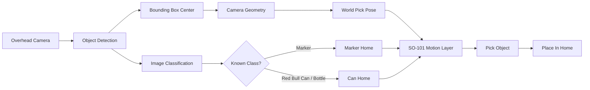
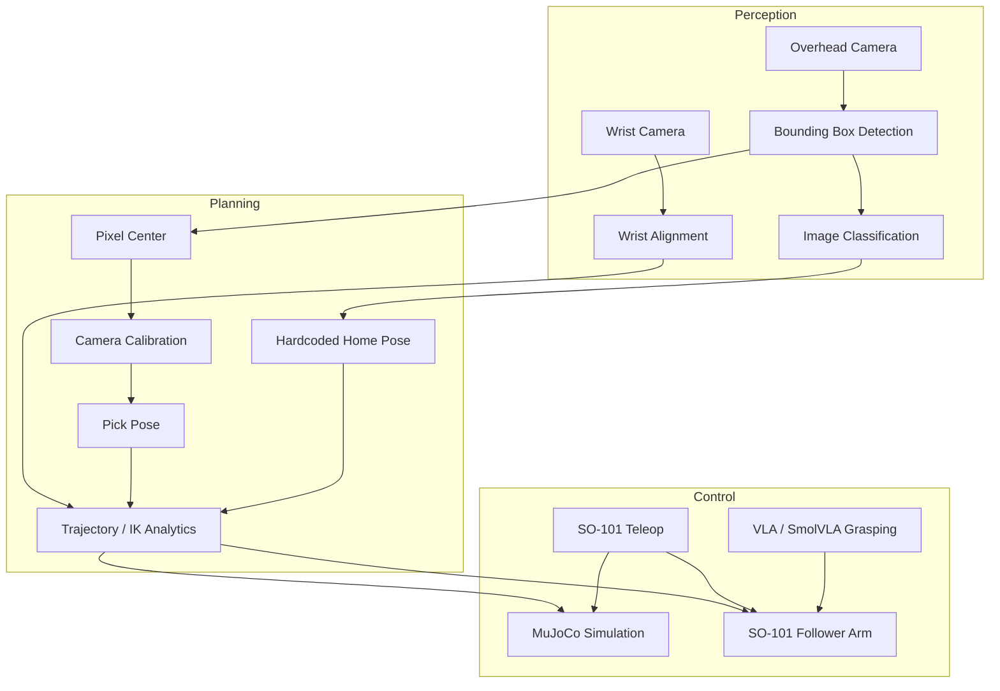
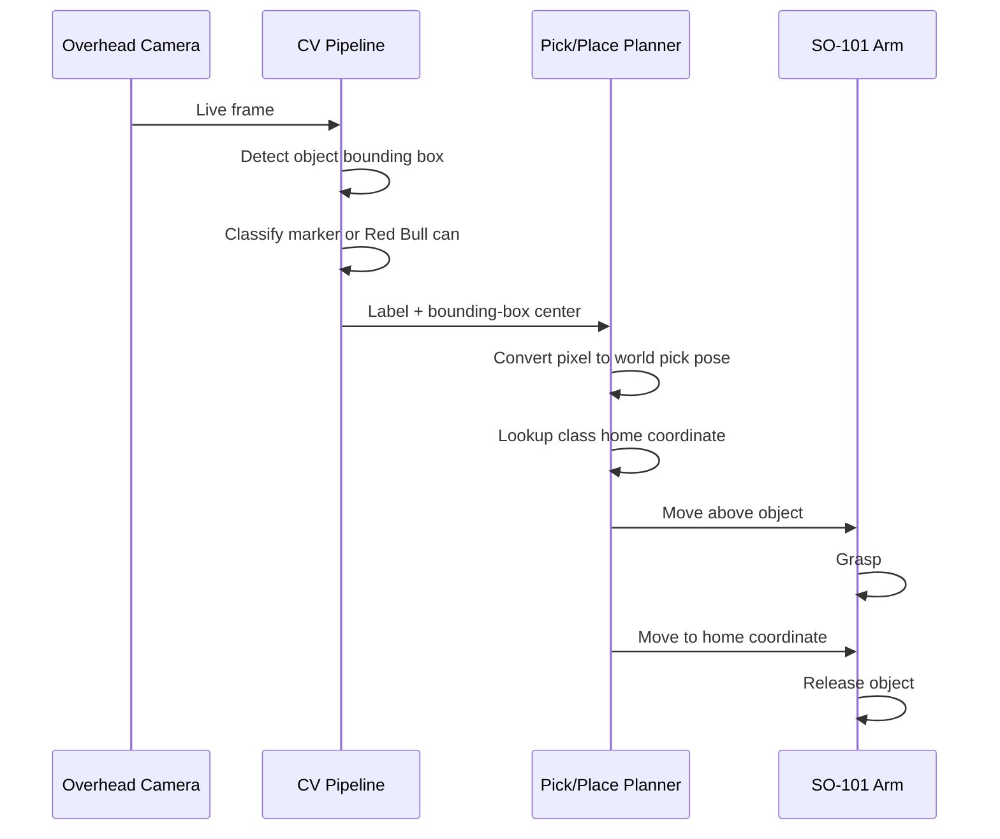

# RoboSort SO-101

<!--
Hero image placeholder:
Add a final system photo or demo GIF here.

Example:

-->

An AI-powered desk-cleaning and maintenance robot built around the SO-101 arm.
The project started from a simple goal: detect random objects on a workspace,
classify what they are, pick them up, and place each object back into its
assigned home position.

The system uses a hybrid robotics approach. Classical computer vision handles
object detection, object classification, bounding boxes, camera geometry, and
workspace analytics. A learned VLA/SmolVLA layer is used as the path toward
robust grasping behavior. Together, the stack turns camera observations into
pick targets, home targets, and robot actions.

Built for the 2026 Robotics Hacklab.

## Demo Preview

> Add final demo images here before submission.

| Workspace View | Detection View | Robot Action |
| --- | --- | --- |
| `docs/images/workspace.jpg` | `docs/images/detection.jpg` | `docs/images/pick-place.gif` |

Suggested assets:

- `docs/images/workspace.jpg`: full desk/workspace image
- `docs/images/detection.jpg`: camera frame with bounding boxes
- `docs/images/pick-place.gif`: short robot pick-and-place GIF
- `docs/images/system-diagram.png`: optional exported architecture diagram

## What It Does

- Detects target objects from a live camera feed.
- Classifies demo objects into easy-to-grasp classes: markers and a bottle/can
  object such as a Red Bull can.
- Converts detected bounding-box centers into world-frame pick coordinates.
- Uses object class labels to route objects to their assigned home positions.
- Uses two-camera visual feedback for trajectory planning and alignment.
- Supports SO-101 leader/follower teleoperation.
- Provides MuJoCo simulation and real-camera overlay tools.
- Includes camera calibration utilities for overhead and wrist cameras.
- Provides early VLA/SmolVLA hooks for learned robot control.

## System Idea



This makes RoboSort a maintenance-style robot: it can help keep a desk or small
workspace organized by returning known object classes to predefined locations.

For the demo, we intentionally narrowed the classification target set to objects
that are easier to grasp reliably: markers and a Red Bull can / bottle-like
object. This keeps the hackathon system focused on end-to-end performance rather
than brittle grasping of irregular objects.

## Architecture



## Pick-And-Place Flow



## Hardware

- SO-101 follower robot arm
- Optional SO-101 leader arm for teleoperation
- USB motor controller / MotorsBus
- Overhead USB camera
- Optional wrist camera
- Demo objects: markers and a Red Bull can / bottle-like object
- Laptop running Ubuntu/Linux
- USB data cables, preferably direct to laptop rather than through a hub
- Workspace frame with calibrated camera view

## Repository Map

```text
object_classification/
  object_classification.py   Live object detection
  pick_pose_node.py          Overhead detection to pick pose
  first_pick_sequence.py     Perception handoff pipeline
  arm_hover_move.py          Move follower to hover pose

py/scripts/
  teleop.py                  SO-101 leader -> MuJoCo / follower teleop
  teleop_mixed.py            Real camera + MuJoCo overlay
  run_vla_sim.py             VLA policy in simulation
  run_vla_real.py            VLA policy on real SO-101 follower

py/src/pick_and_place/
  Core simulation, kinematics, follower, calibration, and trajectory code

config/
  Camera intrinsics and extrinsics
```

## Installation

Clone the repository and enter it:

```bash
git clone https://github.com/hackathon-develop/2026-06_robotics_hacklab.git
cd 2026-06_robotics_hacklab
```

Create or activate the Python environment:

```bash
python3 -m venv venv
source venv/bin/activate
```

Install dependencies:

```bash
pip install -r object_classification/requirements.txt
pip install -e py
```

If using ROS 2 Jazzy tools, source ROS before running ROS-facing scripts:

```bash
source /opt/ros/jazzy/setup.bash
source venv/bin/activate
```

## Camera And Robot Setup

Find available cameras:

```bash
python object_classification/object_classification.py --list-camera-devices
```

Find robot serial ports:

```bash
lerobot-find-port
```

Manual serial check:

```bash
ls /dev/ttyACM* /dev/ttyUSB* /dev/serial/by-id/* 2>/dev/null
```

If the controller appears and disappears, inspect USB logs:

```bash
sudo dmesg | grep -Ei "ttyACM|ttyUSB|USB Single Serial|1a86|55d3|cdc_acm|disconnect|not accepting|unable to enumerate" | tail -n 30
```

## How To Run

### 1. Run Object Detection

```bash
cd object_classification
python object_classification.py 0 \
  --model rf-detr-base-o365 \
  --target-classes Marker,Canned
```

Use a camera path if needed:

```bash
python object_classification.py /dev/video2 \
  --model rf-detr-base-o365 \
  --target-classes Marker,Canned
```

Press `q` in the camera window to stop.

### 2. Estimate Pick Pose

```bash
cd object_classification
python pick_pose_node.py 0 \
  --model rf-detr-base-o365 \
  --target-class Marker \
  --intrinsics ../config/camera_intrinsics/overhead_camera.json \
  --cam-pos 0.0 0.0 0.65 \
  --cam-xmat 1 0 0 0 0 -1 0 1 0 \
  --pick-z 0.0
```

The script prints a pick pose like:

```text
PICK label=marker conf=0.82 pixel=(...)
world=(x, y, z, rx, ry, rz)
```

### 3. Run The First Pick Perception Sequence

```bash
python object_classification/first_pick_sequence.py --help
```

This combines overhead pick detection with wrist alignment and emits structured
pose data for the next motion layer.

### 4. Move The Arm To A Hover Pose

```bash
python object_classification/arm_hover_move.py --help
```

Use this only after the follower is connected, calibrated, and visible as a
stable `/dev/ttyACM*` or `/dev/ttyUSB*` port.

### 5. Teleoperate The Robot

Leader only, visualized in MuJoCo:

```bash
PYTHONPATH=py/src python py/scripts/teleop.py \
  --leader-port /dev/ttyACM0
```

Leader mirrored to follower:

```bash
PYTHONPATH=py/src python py/scripts/teleop.py \
  --leader-port /dev/ttyACM0 \
  --follower-port /dev/ttyACM1
```

Real camera plus MuJoCo overlay:

```bash
PYTHONPATH=py/src python py/scripts/teleop_mixed.py \
  --leader-port /dev/ttyACM0 \
  --overhead-camera 0
```

## Motor Setup

Follower:

```bash
lerobot-setup-motors --robot.type=so101_follower --robot.port=/dev/ttyACM0
```

Leader:

```bash
lerobot-setup-motors --teleop.type=so101_leader --teleop.port=/dev/ttyACM0
```

Do not include placeholder brackets such as `<FOLLOWER_PORT>`. Replace them with
real device paths like `/dev/ttyACM0`.

The motor setup tool expects only the prompted motor to be connected. If the arm
is preassembled and motors cannot be disconnected, skip this step unless the
motor IDs must be reflashed.

## Calibration

Camera calibration files live here:

```text
config/camera_intrinsics/overhead_camera.json
config/camera_intrinsics/wrist_camera.json
config/camera_extrinsics/overhead_camera.json
```

Solve overhead camera extrinsics:

```bash
cd py
PYTHONPATH=src python -m pick_and_place.cam_align_solve \
  --camera 0 \
  --intrinsics ../config/camera_intrinsics/overhead_camera.json
```

## Testing

Run the Python test suite:

```bash
cd py
pytest
```

Run one test file:

```bash
cd py
pytest tests/test_trajectory.py
```

## Troubleshooting

`ModuleNotFoundError: rclpy`

```bash
source /opt/ros/jazzy/setup.bash
source venv/bin/activate
```

No robot port appears:

```bash
ls /dev/ttyACM* /dev/ttyUSB* 2>/dev/null
```

Try another data USB cable, plug directly into the laptop, and check `dmesg`.

NumPy / `cv_bridge` errors:

Use the pinned object-classification requirements. ROS Jazzy `cv_bridge` is
sensitive to NumPy ABI compatibility.

## Demo Flow

1. Connect overhead camera and SO-101 controller.
2. Confirm camera and serial ports.
3. Run object detection for marker and Red Bull can / canned-object classes.
4. Run pick-pose estimation.
5. Use teleop or motion scripts to validate robot movement.
6. Tune camera calibration and target coordinates for the final workspace.

## Project Status

This is a hackathon prototype. The perception, simulation, teleoperation, and
hardware pieces are present, but final reliability depends on camera calibration,
stable USB hardware, and tuned workspace coordinates.

## License

See [LICENSE](LICENSE).
